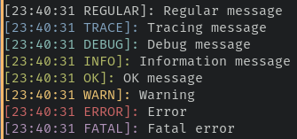
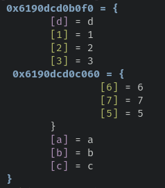
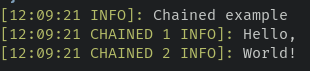
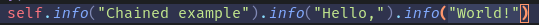

# loggy
Simple `lua` logging utility.

## Preview:
 

## Types of messages:
- **Regular** (`regular`): Regular message.
- **Trace** (`trace`): Tracing message.
- **Debug** (`debug`): Common debug message.
- **Info** (`info`): Information/Note message.
- **Ok** (`ok`): Indicates something works.
- **Warn** (`warn`): Warning.
- **Error** (`error`): Error.
- **Fatal** (`fatal`): Fatal error.

## Message chaining
You can chain messages to section logs or log information in various lines in a more readable way.

 



# Installation
1. Clone the library
```bash
git clone https://github.com/Nykenik24/loggy loggy
```
2. Require the library
```lua
local loggy = require("loggy")
```

# Usage
When you have loggy installed, you can use it like this:
```lua
local loggy = require("loggy")

-- Normal messages          Chained messages
loggy.message_type(message).message_type(message)
```
If you have long chained sections, you can use this syntax:
```lua
loggy.message_type(message)
.message_type(message)
.message_type(message)
.message_type(message)
```

---
**Loggy was adapted from the `logger` module of my library [Love2d Tools](https://github.com/Nykenik24/love2d-tools)**
